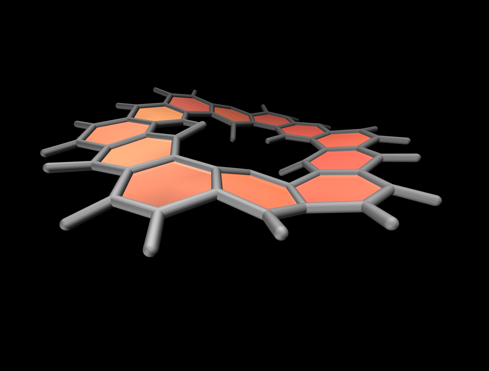
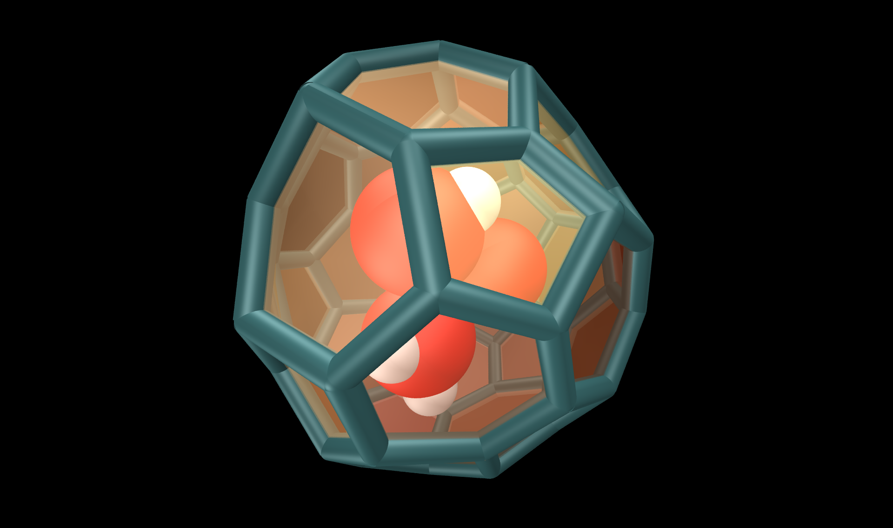
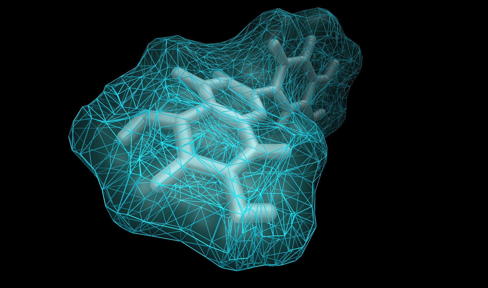
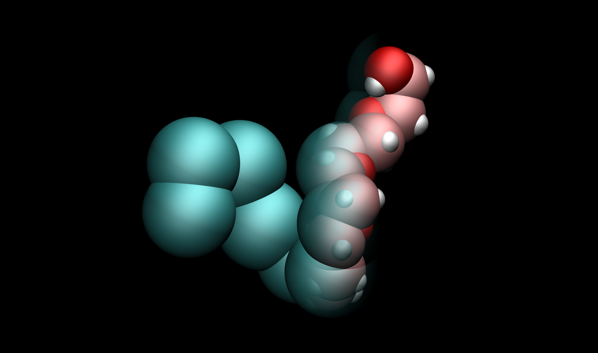

# Gallery of molecules

The [gallery of molecules](https://simongravelle.github.io/gallery/) contains scripts,
HR images and videos.

  

  

  

  

Some of the videos are also used on [Youtube](https://www.youtube.com/c/simongravelle).
