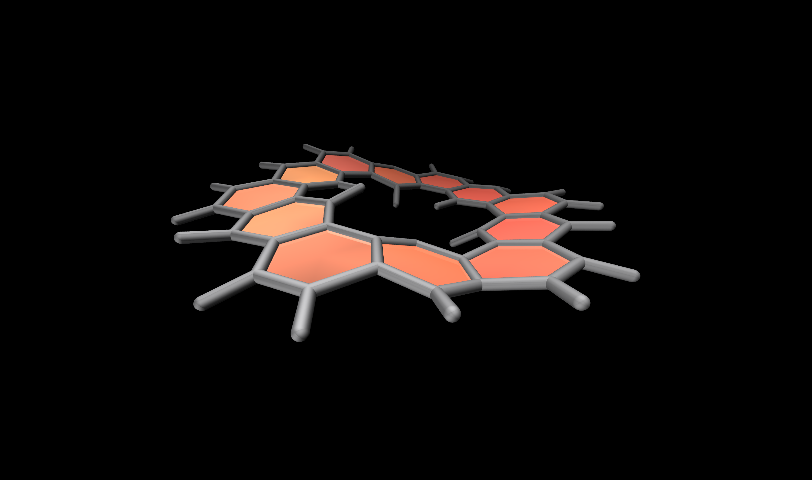

# The molecular art gallery

The [molecular art gallery](https://simongravelle.github.io/gallery/) contains scripts and
high resolution pictures. Feel free to re-use everything you find here.

  

  

  

Some of the scripts are used to make [videos](https://www.youtube.com/c/simongravelle).

### How it is done ###

Most figure are generated using [VMD](https://www.ks.uiuc.edu/Research/vmd/),
from molecular dynamics simulations done with [LAMMPS](https://www.lammps.org/#gsc.tab=0) using topology
from the [atb](https://atb.uq.edu.au/).

### About me ###

I am a computer physicist in soft matter and fluids at interfaces. You can 
find more information on my [personal webpage](https://simongravelle.github.io/).

### License ###

All the inputs and figures are released under the 
GNU general public license v3.0.