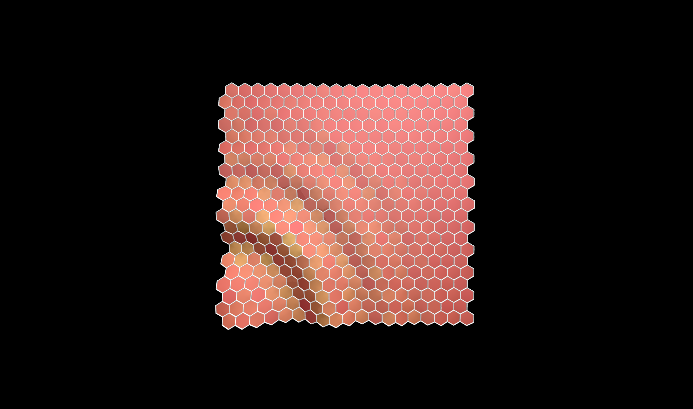

# Molecular art

The [gallery of molecules](https://simongravelle.github.io/gallery/) contains scripts and
high resolution pictures. Feel free to re-use these pictures or scripts, everything is 
under the GNU GENERAL PUBLIC LICENSE.

  

  

  

Some of the videos are also used on [Youtube](https://www.youtube.com/c/simongravelle).
